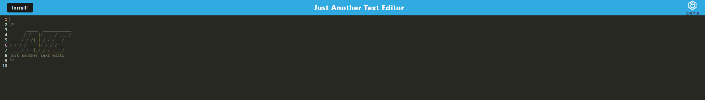

# JATE Text Editor
[](https://opensource.org/licenses/MIT)

## Table of Contents
- [Description](#Description)
- [Installation](#Installation)
- [Usage](#Usage)
- [Testing](#Testing)
- [Contribution](#Contribution)
- [Contact](#Contact)

## Description
This is an application that provides a browser-hosted and installable text editor using PWAs. The application can be installed and run without an internet connection, and any text inputted will be retained upon reloading. An image of the deployed application is shown below.



## Installation
To install the dependencies required for the application, run the following line in the terminal.

```
npm install
```

## Usage
To run locally:
- Clone the repository to your local computer
- Install all required dependencies by running ```npm install``` in the integrated terminal in the root of the repository.
- Run ```npm run build``` in the terminal.
- Run ```npm start``` in the terminal to launch the application. The port will be displayed in the terminal: navigate to http://localhost:(PORT) to view (default 3000).

To access the deployed application, use the following [link](https://jate-text-editor-aashley.herokuapp.com/). To prevent loss of the typed text upon reload, click off of the editor (e.g. onto the header) before reloading.

## Testing
To test the application, run the following line in the terminal.

```
npm test
```

## Contribution
N/A

## Contact
If you have questions, contact the author of the repository, Annie14254, at annieyashley@gmail.com.

